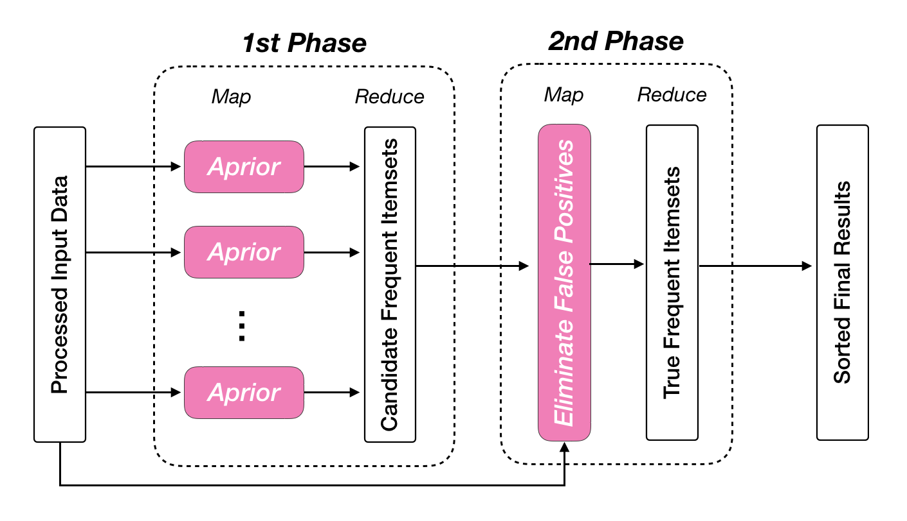
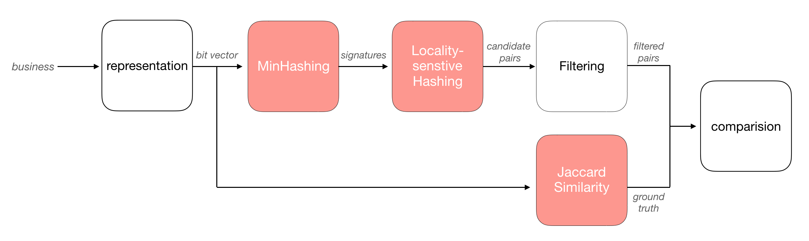
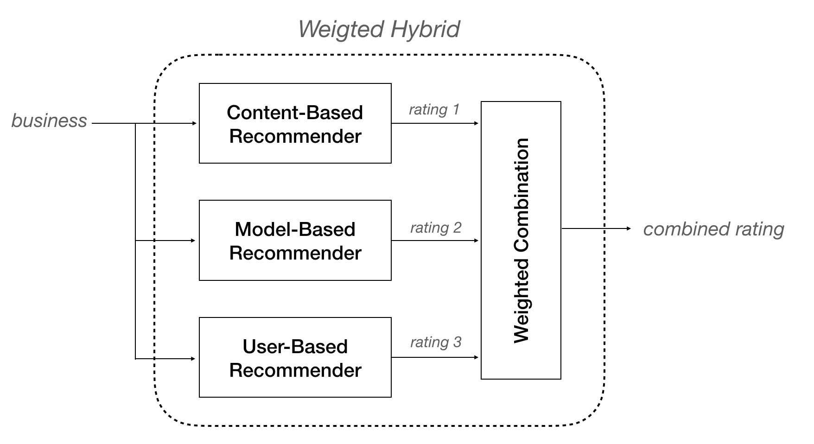
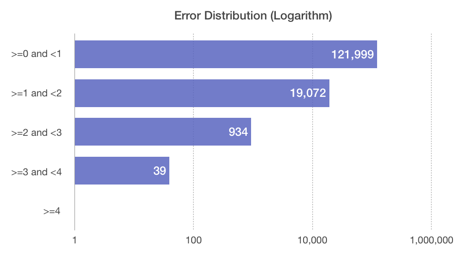

<!-- **💡Note: This is a private repository, so `View on GitHub` will give a 404 error.** -->

# Mining-Yelp-Dataset-with-Spark
Big Data Mining using Apache Spark, data source: https://www.yelp.com/dataset

## Contributors

|                           |   
|---------------------------------|:---------------------------:|   
| Yuying Wang          |    Yang Zheng    | 

## This Repository <a name="description-of-files"><a/> 

| File                            |      Description            |
|---------------------------------|:---------------------------:|
| `data_exploration.ipynb`          |     exploratory data analysis on the yelp dataset   |
| `frequent_itemset_mining.ipynb`   |   mining frequent itemsets using SON, A-Priori algorithm |
| `similar_businesses.py`   |  detecting similar businesses using MinHash and LSH algorithm  |
| `hybrid_recommender_system.py`   | combination of different types of recommendation techniques |

## Table of Contents
* [Data Exploration](#data-exploration)
* [Frequent Itemset Mining](#frequent-itemset-mining)
* [Similar Businesses](#similar-businesses)
* [Hybrid Recommender System](#hybrid-recommender-system)

 

## Data Exploration <a name="data-exploration"/>

We performed an Exploratory Data Analysis on the dataset, and here are some Interesting Findings:
- TBA
- TBA

## Frequent Itemset Mining <a name="frequent-itemset-mining"/>
### High level design

### Conclusion

 Not surprisingly, we found that the restaurants are **geographically close** to each other or they **serve similar food** (maybe have similar business names) in almost all frequent sets. (*e.g. Ramen Sora, Sushi House Goyemon, Monta Ramen*)

## Similar Businesses <a name="similar-businesses"/>
### High level design

First we use **MinHash** to generate signature of each business, then apply **LSH** to find all candidate pairs, and finally do a full pass to eliminate all false positives. 

### Results
We spent quite some time on designing **hash functions**, and suprisingly, we achieve **precision=1.0** and **recall=1.0** .

## Hybrid Recommender System <a name="hybrid-recommender-system"/>

### High level design

Each candidate is rated by 3 recommenders: **content-based filtering, model-based collaborative filtering, and user-based CF**.  A linear combination of the 3 scores computed, which becomes the item's predicted rating.

### Results: 
The ratings range from 1 to 5, and the error distribution on testing data looks like: 

About **98%** prediction error are less than 1.0, and the overall **RMSE** is 0.9782, which is much better than any individual recommender system.

## Dependencies <a name="dependencies"/>
* Spark 2.4
* Python 3.6
* JDK 1.8
